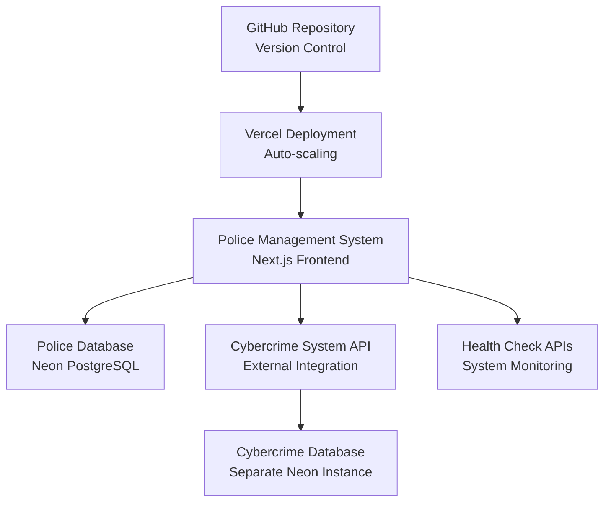
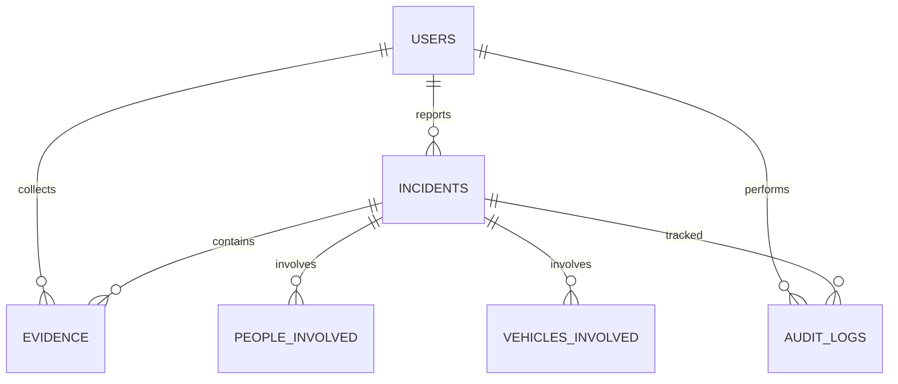

# 🎖️ PNG Police Management System - Complete Technical Documentation

## Royal Papua New Guinea Constabulary Digital Transformation Platform

**Version**: 1.0.0
**Last Updated**: January 2025
**Author**: PNG Constabulary IT Department
**Repository**: `tpdc055/policemanagementsystem`
**Production URL**: Deployed on Vercel with GitHub Integration

---

## 📋 Table of Contents

1. [System Overview](#system-overview)
2. [Architecture & Integration](#architecture--integration)
3. [Core Modules & Functions](#core-modules--functions)
4. [Cybercrime Integration](#cybercrime-integration)
5. [User Interface Components](#user-interface-components)
6. [API Endpoints](#api-endpoints)
7. [Database Structure](#database-structure)
8. [Security Features](#security-features)
9. [Deployment Configuration](#deployment-configuration)
10. [Technical Specifications](#technical-specifications)

---

## 🎯 System Overview

### Primary Purpose
The PNG Police Management System is a comprehensive digital platform designed to modernize law enforcement operations for the Royal Papua New Guinea Constabulary. It integrates traditional police management functions with advanced cybercrime investigation capabilities through seamless system integration.

### Key Capabilities
- **Incident Management**: Complete incident reporting, tracking, and investigation workflow
- **Case Management**: Criminal case lifecycle management with evidence tracking
- **Personnel Management**: Officer profiles, assignments, and performance tracking
- **Evidence Management**: Digital evidence collection, chain of custody, and forensic integration
- **Criminal Records**: Comprehensive criminal database with biometric identification
- **Cybercrime Integration**: Real-time data feeds from specialized cybercrime investigation unit
- **Analytics Dashboard**: Real-time operational analytics and crime pattern analysis
- **Mobile Responsive**: Full functionality across desktop, tablet, and mobile devices

### Technology Stack
- **Frontend**: Next.js 15 with React 18 and TypeScript
- **UI Framework**: shadcn/ui with Tailwind CSS
- **Database**: Neon PostgreSQL (separate instances for police and cybercrime systems)
- **Authentication**: Session-based with automatic login bypass
- **Deployment**: Vercel with GitHub auto-deployment
- **Package Manager**: Bun for enhanced performance
- **Build System**: Next.js App Router with Turbopack

---

## 🏗️ Architecture & Integration

### System Architecture



### Integration Model
The system operates on a **dual-system architecture** where:

1. **Police Management System** (Primary)
   - Handles traditional police operations
   - Serves as the main dashboard and entry point
   - Integrates data from cybercrime system via API calls

2. **Cybercrime Investigation System** (Specialized)
   - Operates as standalone system at `https://cybercrime-3h6o.vercel.app`
   - Provides specialized cybercrime investigation tools
   - Feeds real-time data to police dashboard

3. **Data Integration**
   - **API-based communication** between systems
   - **Real-time statistics** displayed in police dashboard
   - **Secure external linking** to cybercrime system
   - **Independent operations** - both systems function autonomously

---

## 🔧 Core Modules & Functions

### 1. Dashboard Module (`/src/app/dashboard/page.tsx`)

#### Purpose
Central command center providing real-time operational overview and quick access to all system functions.

#### Key Functions
- **Operational Statistics Display**
  - Active incidents count with trending indicators
  - Open cases tracking with solve rate metrics
  - Officers on duty with deployment percentages
  - Average response time monitoring

- **Emergency Alerts Management**
  - BOLO (Be On the Lookout) alerts display
  - High-priority incident notifications
  - Regional status monitoring

- **Quick Actions Panel**
  ```typescript
  // Core quick action functions
  - Report Incident: Direct access to incident creation
  - New Case: Case management workflow initiation
  - Emergency Dispatch: Priority dispatch system
  - Search Criminal: Criminal database query interface
  ```

- **Cybercrime Integration Panel**
  - Real-time cybercrime statistics
  - Active cybercrime cases monitoring
  - Financial recovery tracking
  - Direct access to cybercrime system

#### Advanced Features
- **Real-time Data Updates**: Automatic refresh every 30 seconds
- **Regional Status Monitoring**: Multi-province operational overview
- **Alert Prioritization**: Color-coded priority system (Low/Medium/High/Critical)
- **Performance Metrics**: Response time tracking and improvement indicators

### 2. Incident Management System (`/src/app/incidents/`)

#### Core Functionality
Comprehensive incident reporting and tracking system with advanced investigation capabilities.

#### Key Components

##### A. Incident Reporting (`/incidents/new/page.tsx`)
**Purpose**: Multi-step incident report creation with evidence collection.

**Functions**:
- **Basic Information Collection**
  ```typescript
  interface IncidentData {
    incident_type: string        // 23 predefined types + custom
    title: string               // Brief incident description
    description: string         // Detailed narrative
    location_address: string    // Precise location data
    location_coordinates: [number, number] // GPS coordinates
    priority: 'low' | 'medium' | 'high' | 'critical'
    date_occurred: string       // Incident timestamp
    weather_conditions: string  // Environmental factors
    visibility: string          // Visibility conditions
  }
  ```

- **People Involved Tracking**
  ```typescript
  interface PersonInvolved {
    person_type: 'victim' | 'suspect' | 'witness' | 'complainant'
    first_name: string
    last_name: string
    gender: string
    date_of_birth: string
    nationality: string
    phone: string
    email: string
    address: string
    physical_description: string
    statement_given: boolean
    cooperation_level: 'cooperative' | 'uncooperative' | 'unknown'
  }
  ```

- **Vehicle Information System**
  ```typescript
  interface VehicleInvolved {
    vehicle_type: string        // Car, truck, motorcycle, etc.
    make: string               // Vehicle manufacturer
    model: string              // Vehicle model
    year: number               // Manufacturing year
    color: string              // Vehicle color
    license_plate: string      // License plate number
    owner_name: string         // Registered owner
    driver_name: string        // Driver at time of incident
    damage_description: string // Physical damage assessment
    towed: boolean             // Tow status
    impounded: boolean         // Impound status
  }
  ```

- **Evidence Collection Integration**
  - Photo capture with metadata
  - GPS location tagging
  - Chain of custody initiation
  - Evidence categorization

##### B. Advanced Investigation Features
- **Biometric Data Collection**
  - Fingerprint capture and analysis
  - Facial recognition integration
  - DNA sample tracking
  - Digital forensics coordination

- **Inter-system Communication**
  - Automatic case linking between police and cybercrime systems
  - Real-time status updates
  - Evidence sharing protocols

### 3. Case Management System (`/src/app/cases/`)

#### Purpose
Complete criminal case lifecycle management from initiation to resolution.

#### Core Functions
- **Case Creation and Assignment**
  ```typescript
  interface Case {
    case_number: string         // Unique case identifier
    title: string              // Case title
    description: string        // Case summary
    priority: 'LOW' | 'MEDIUM' | 'HIGH' | 'URGENT'
    status: 'OPEN' | 'IN_PROGRESS' | 'UNDER_REVIEW' | 'CLOSED'
    investigating_officer: string
    supervisor: string
    suspects: Person[]
    victims: Person[]
    witnesses: Person[]
    evidence: Evidence[]
    related_incidents: Incident[]
  }
  ```

- **Investigation Workflow Management**
  - Task assignment and tracking
  - Evidence evaluation
  - Witness interview scheduling
  - Court preparation assistance

- **Case Analytics**
  - Case resolution time tracking
  - Success rate analysis
  - Resource allocation optimization
  - Pattern recognition for crime trends

### 4. Personnel Management (`/src/app/personnel/`)

#### Officer Profile Management
```typescript
interface Officer {
  id: string
  badge_number: string
  rank: string
  first_name: string
  last_name: string
  department: string
  station: string
  province: string
  specializations: string[]
  certifications: Certification[]
  performance_metrics: PerformanceData
  current_assignments: Assignment[]
  training_records: TrainingRecord[]
}
```

#### Advanced Features
- **Performance Tracking**
  - Case closure rates
  - Response time averages
  - Community feedback scores
  - Training completion status

- **Assignment Management**
  - Skill-based assignment algorithms
  - Workload balancing
  - Geographical optimization
  - Specialization matching

- **Training Coordination**
  - Mandatory training tracking
  - Certification management
  - Skills development planning
  - Performance improvement programs

### 5. Evidence Management System (`/src/app/evidence/`)

#### Digital Evidence Handling
```typescript
interface Evidence {
  evidence_number: string     // Unique identifier
  evidence_type: 'physical' | 'digital' | 'biological' | 'documentary'
  category: string           // Specific evidence category
  description: string        // Detailed description
  location_found: string     // Discovery location
  collected_by: string       // Collecting officer
  date_collected: string     // Collection timestamp
  chain_of_custody: ChainOfCustodyEntry[]
  photos: string[]           // Evidence photographs
  analysis_results: AnalysisResult[]
  court_admissible: boolean
}
```

#### Chain of Custody Management
- **Custody Transfer Tracking**
  ```typescript
  interface ChainOfCustodyEntry {
    handler: string           // Person handling evidence
    action: string           // Action performed
    timestamp: string        // Action timestamp
    location: string         // Physical location
    purpose: string          // Reason for handling
    signature: string        // Digital signature
  }
  ```

#### Advanced Evidence Features
- **Digital Forensics Integration**
  - File hash verification
  - Metadata preservation
  - Data recovery assistance
  - Network traffic analysis

- **Biometric Evidence Processing**
  - Fingerprint database integration
  - DNA sample tracking
  - Facial recognition matching
  - Voice pattern analysis

### 6. Criminal Records Database (`/src/app/criminals/`)

#### Comprehensive Criminal Profiles
```typescript
interface CriminalProfile {
  criminal_id: string
  personal_info: PersonalInformation
  aliases: string[]
  known_addresses: Address[]
  phone_numbers: string[]
  email_addresses: string[]
  physical_description: PhysicalDescription
  identification_marks: IdentificationMark[]
  biometric_data: BiometricData
  criminal_history: CriminalRecord[]
  known_associates: Associate[]
  vehicles: Vehicle[]
  behavioral_patterns: BehaviorPattern[]
}
```

#### Advanced Search Capabilities
- **Multi-parameter Search**
  - Name variations and aliases
  - Physical characteristics
  - Biometric matching
  - Location-based queries
  - Associate network analysis

- **Pattern Recognition**
  - Modus operandi identification
  - Geographical crime patterns
  - Temporal behavior analysis
  - Network relationship mapping

### 7. Analytics and Reporting (`/src/app/analytics/`)

#### Crime Analytics Engine
- **Statistical Analysis**
  - Crime trend identification
  - Hotspot mapping
  - Seasonal pattern recognition
  - Resource allocation optimization

- **Predictive Analytics**
  - Crime forecasting models
  - Risk assessment algorithms
  - Resource demand prediction
  - Prevention strategy optimization

#### Performance Metrics
```typescript
interface PerformanceMetrics {
  response_times: ResponseTimeData
  case_closure_rates: ClosureRateData
  officer_productivity: ProductivityMetrics
  resource_utilization: ResourceData
  public_satisfaction: SatisfactionScores
}
```

---

## 🔗 Cybercrime Integration

### Real-time Data Integration

#### API Communication Architecture
```typescript
interface CybercrimeAPI {
  endpoint: "https://cybercrime-3h6o.vercel.app/api/integration/police-system"
  authentication: "x-api-key: production-api-key-12345"
  methods: {
    getStatistics: () => Promise<CybercrimeStats>
    getCases: (params: SearchParams) => Promise<CyberCase[]>
    getAlerts: () => Promise<Alert[]>
    linkCase: (policeCase: string, cyberCase: string) => Promise<boolean>
  }
}
```

#### Dashboard Integration Features

##### A. Cybercrime Statistics Panel (`/src/components/dashboard/cybercrime-stats.tsx`)
**Real-time Data Display**:
```typescript
interface CybercrimeStats {
  totalCases: number              // All cybercrime cases
  openCases: number              // Currently active cases
  inProgressCases: number        // Under investigation
  closedCases: number            // Resolved cases
  urgentCases: number            // High-priority cases
  recentCases: CyberCase[]       // Latest 5 cases
  topOffenseTypes: OffenseType[] // Most common cyber crimes
  monthlyTrends: TrendData       // Monthly comparison data
}
```

**Advanced Features**:
- **Automatic Refresh**: Updates every 30 seconds
- **Error Handling**: Graceful fallback to cached data
- **Visual Indicators**: Real-time connection status
- **Interactive Elements**: Click-through to detailed views

##### B. Cybercrime Navigation Integration
**Sidebar Navigation Enhancement**:
```tsx
// Enhanced navigation with cybercrime unit
{
  name: "Cybercrime Unit",
  href: "https://cybercrime-3h6o.vercel.app",
  icon: Monitor,
  external: true,
  className: "text-red-600 hover:text-red-700",
  badge: "External"
}
```

#### Cross-System Case Linking
```typescript
interface CaseLinking {
  linkPoliceCase: (policeCaseId: string, cyberCaseId: string) => {
    creates: "Bidirectional case reference"
    updates: "Both system databases"
    notifications: "Relevant officers in both systems"
    audit_trail: "Complete action logging"
  }

  syncInvestigationData: () => {
    evidence_sharing: "Digital evidence coordination"
    witness_information: "Cross-referenced witness data"
    suspect_profiles: "Unified suspect tracking"
    timeline_coordination: "Synchronized investigation timelines"
  }
}
```

#### Webhook Integration System
```typescript
interface WebhookEndpoints {
  "/api/webhooks/cybercrime": {
    purpose: "Receive urgent cybercrime alerts"
    authentication: "HMAC signature verification"
    processing: "Real-time alert distribution"
    notifications: "Officer mobile alerts"
  }

  "/api/webhooks/case-updates": {
    purpose: "Sync case status changes"
    frequency: "Real-time updates"
    data_types: ["status_changes", "evidence_updates", "officer_assignments"]
  }
}
```

### Cybercrime System Capabilities

#### Digital Forensics Integration
- **Network Traffic Analysis**: Deep packet inspection and flow analysis
- **Malware Detection**: Signature-based and behavioral analysis
- **Data Recovery**: Deleted file recovery and data carving
- **Encryption Breaking**: Cryptographic analysis capabilities

#### Social Media Monitoring
```typescript
interface SocialMediaMonitoring {
  platforms: ["Facebook", "Instagram", "TikTok", "Twitter", "WhatsApp"]
  capabilities: {
    profile_analysis: "Suspect social media profiling"
    content_monitoring: "Threat detection and analysis"
    network_mapping: "Social connection analysis"
    evidence_collection: "Court-admissible social media evidence"
  }
}
```

#### Financial Crime Detection
- **Transaction Analysis**: Pattern recognition in financial data
- **Cryptocurrency Tracking**: Blockchain analysis and wallet tracing
- **Money Laundering Detection**: Suspicious transaction identification
- **Asset Recovery**: Digital asset location and seizure assistance

---

## 🎨 User Interface Components

### Design System Architecture

#### Component Library Structure
```
src/components/
├── ui/                     # shadcn/ui base components
│   ├── button.tsx         # Enhanced button with loading states
│   ├── card.tsx           # Police-themed card components
│   ├── form.tsx           # Form validation and submission
│   ├── table.tsx          # Data table with sorting/filtering
│   └── dialog.tsx         # Modal dialogs for complex interactions
├── layout/                # Layout components
│   ├── dashboard-layout.tsx # Main application layout
│   └── navigation.tsx     # Sidebar and mobile navigation
├── dashboard/             # Dashboard-specific components
│   ├── cybercrime-stats.tsx # Cybercrime integration panel
│   ├── quick-actions.tsx  # Emergency action buttons
│   └── alerts-panel.tsx   # Active alerts display
└── auth/                  # Authentication components
    └── login-form.tsx     # Bypassed login form
```

#### Advanced UI Features

##### A. Responsive Design System
```typescript
interface ResponsiveDesign {
  breakpoints: {
    mobile: "< 768px"     // Full mobile optimization
    tablet: "768px - 1024px" // Tablet-specific layouts
    desktop: "> 1024px"   // Full desktop experience
  }

  adaptive_features: {
    navigation: "Collapsible sidebar on mobile"
    tables: "Horizontal scroll with sticky columns"
    forms: "Single-column layout on mobile"
    charts: "Simplified charts on small screens"
  }
}
```

##### B. Accessibility Features
- **WCAG 2.1 AA Compliance**: Full accessibility standard compliance
- **Keyboard Navigation**: Complete keyboard-only operation
- **Screen Reader Support**: ARIA labels and semantic markup
- **High Contrast Mode**: Enhanced visibility options
- **Font Size Scaling**: Dynamic text size adjustment

##### C. Interactive Elements
```typescript
interface InteractiveFeatures {
  real_time_updates: {
    dashboard_stats: "Auto-refresh every 30 seconds"
    alert_notifications: "Real-time push notifications"
    case_status_changes: "Live status updates"
  }

  data_visualization: {
    crime_maps: "Interactive geographical crime mapping"
    trend_charts: "Dynamic statistical visualizations"
    timeline_views: "Investigation timeline visualization"
  }

  workflow_optimization: {
    quick_actions: "One-click common operations"
    smart_forms: "Auto-completion and validation"
    batch_operations: "Multi-item bulk actions"
  }
}
```

### Theme Configuration
```typescript
interface PoliceTheme {
  primary_colors: {
    blue: "#1e40af"        // Police blue
    red: "#dc2626"         // Emergency red
    green: "#16a34a"       // Success green
    yellow: "#ca8a04"      // Warning yellow
  }

  semantic_colors: {
    incident_high: "#ef4444"    // High priority incidents
    incident_medium: "#f97316"  // Medium priority
    incident_low: "#10b981"     // Low priority
    cybercrime: "#dc2626"       // Cybercrime-related
    evidence: "#6366f1"         // Evidence-related
  }
}
```

---

## 🔌 API Endpoints

### Police System API Routes

#### Core System APIs
```typescript
// Health and System Status
GET  /api/health
Response: {
  status: "healthy" | "unhealthy"
  timestamp: string
  services: {
    database: boolean
    cybercrime_integration: boolean
  }
  uptime: number
}

// Database Management
GET  /api/test-neon              // Database connection test
POST /api/setup-neon-database    // Database initialization
GET  /api/create-tables          // Table creation
```

#### Data Management APIs
```typescript
// Incident Management
GET    /api/incidents            // List all incidents
POST   /api/incidents            // Create new incident
GET    /api/incidents/:id        // Get specific incident
PUT    /api/incidents/:id        // Update incident
DELETE /api/incidents/:id        // Delete incident

// Case Management
GET    /api/cases               // List all cases
POST   /api/cases               // Create new case
GET    /api/cases/:id           // Get specific case
PUT    /api/cases/:id           // Update case
DELETE /api/cases/:id           // Delete case

// Evidence Management
GET    /api/evidence            // List all evidence
POST   /api/evidence            // Submit new evidence
GET    /api/evidence/:id        // Get specific evidence
PUT    /api/evidence/:id        // Update evidence
POST   /api/evidence/:id/custody // Update chain of custody
```

#### Integration APIs
```typescript
// Cybercrime Integration
GET  /api/cybercrime/stats      // Get cybercrime statistics
GET  /api/cybercrime/cases      // Get cybercrime cases
POST /api/cybercrime/link-case  // Link police case to cybercrime case

// Webhook Endpoints
POST /api/webhooks/cybercrime   // Receive cybercrime alerts
POST /api/webhooks/case-updates // Receive case status updates
```

### Cybercrime System API Integration

#### External API Consumption
```typescript
interface CybercrimeAPIEndpoints {
  base_url: "https://cybercrime-3h6o.vercel.app"

  endpoints: {
    "/api/integration/police-system": {
      method: "GET"
      purpose: "Fetch cybercrime statistics and case data"
      authentication: "x-api-key header"
      response: CybercrimeStats
    }

    "/api/health": {
      method: "GET"
      purpose: "Check cybercrime system health"
      response: HealthStatus
    }

    "/api/cases": {
      method: "GET"
      purpose: "Retrieve cybercrime case list"
      parameters: {
        limit: number
        offset: number
        status: string
        priority: string
      }
    }
  }
}
```

#### Authentication & Security
```typescript
interface APIAuthentication {
  method: "API Key Authentication"
  headers: {
    "x-api-key": "production-api-key-12345"
    "Content-Type": "application/json"
  }

  webhook_security: {
    signature_verification: "HMAC-SHA256"
    secret: "production-webhook-secret-67890"
    timestamp_validation: "±5 minutes tolerance"
  }
}
```

---

## 🗄️ Database Structure

### Police System Database Schema

#### Core Tables
```sql
-- Users/Officers Table
CREATE TABLE users (
    id SERIAL PRIMARY KEY,
    badge_number VARCHAR(20) UNIQUE NOT NULL,
    email VARCHAR(255),
    first_name VARCHAR(100) NOT NULL,
    last_name VARCHAR(100) NOT NULL,
    rank VARCHAR(50) NOT NULL,
    department VARCHAR(100),
    station VARCHAR(100),
    province VARCHAR(100),
    phone VARCHAR(20),
    status VARCHAR(20) DEFAULT 'active',
    role VARCHAR(50) DEFAULT 'officer',
    permissions JSONB,
    profile_photo TEXT,
    fingerprint_data JSONB,
    created_at TIMESTAMP DEFAULT CURRENT_TIMESTAMP,
    updated_at TIMESTAMP DEFAULT CURRENT_TIMESTAMP,
    last_login TIMESTAMP
);

-- Incidents Table
CREATE TABLE incidents (
    id SERIAL PRIMARY KEY,
    incident_number VARCHAR(50) UNIQUE NOT NULL,
    incident_type VARCHAR(100) NOT NULL,
    title VARCHAR(255) NOT NULL,
    description TEXT,
    location_address TEXT NOT NULL,
    location_coordinates POINT,
    province VARCHAR(100),
    district VARCHAR(100),
    priority VARCHAR(20) DEFAULT 'medium',
    status VARCHAR(20) DEFAULT 'reported',
    reported_by VARCHAR(20) REFERENCES users(badge_number),
    assigned_to VARCHAR(20) REFERENCES users(badge_number),
    supervisor VARCHAR(20) REFERENCES users(badge_number),
    date_reported TIMESTAMP DEFAULT CURRENT_TIMESTAMP,
    date_occurred TIMESTAMP,
    date_resolved TIMESTAMP,
    photos TEXT[],
    videos TEXT[],
    witness_count INTEGER DEFAULT 0,
    evidence_count INTEGER DEFAULT 0,
    weapons_involved BOOLEAN DEFAULT FALSE,
    drugs_involved BOOLEAN DEFAULT FALSE,
    domestic_violence BOOLEAN DEFAULT FALSE,
    created_at TIMESTAMP DEFAULT CURRENT_TIMESTAMP,
    updated_at TIMESTAMP DEFAULT CURRENT_TIMESTAMP
);

-- Evidence Table
CREATE TABLE evidence (
    id SERIAL PRIMARY KEY,
    evidence_number VARCHAR(50) UNIQUE NOT NULL,
    incident_id INTEGER REFERENCES incidents(id),
    case_id INTEGER,
    evidence_type VARCHAR(50) NOT NULL,
    category VARCHAR(100) NOT NULL,
    description TEXT NOT NULL,
    location_found TEXT,
    found_by VARCHAR(20) REFERENCES users(badge_number),
    collected_by VARCHAR(20) REFERENCES users(badge_number),
    date_collected TIMESTAMP DEFAULT CURRENT_TIMESTAMP,
    photos TEXT[],
    videos TEXT[],
    file_attachments TEXT[],
    chain_of_custody JSONB,
    status VARCHAR(20) DEFAULT 'collected',
    storage_location TEXT,
    custodian VARCHAR(20) REFERENCES users(badge_number),
    created_at TIMESTAMP DEFAULT CURRENT_TIMESTAMP
);
```

#### Advanced Tables
```sql
-- People Involved in Incidents
CREATE TABLE people_involved (
    id SERIAL PRIMARY KEY,
    incident_id INTEGER REFERENCES incidents(id),
    person_type VARCHAR(20) NOT NULL, -- victim, suspect, witness, complainant
    first_name VARCHAR(100) NOT NULL,
    last_name VARCHAR(100) NOT NULL,
    middle_name VARCHAR(100),
    gender VARCHAR(20),
    date_of_birth DATE,
    nationality VARCHAR(100) DEFAULT 'Papua New Guinea',
    phone VARCHAR(20),
    email VARCHAR(255),
    address TEXT,
    physical_description TEXT,
    role_in_incident TEXT,
    injuries TEXT,
    statement_given BOOLEAN DEFAULT FALSE,
    cooperation_level VARCHAR(20) DEFAULT 'cooperative',
    created_at TIMESTAMP DEFAULT CURRENT_TIMESTAMP
);

-- Vehicles Involved
CREATE TABLE vehicles_involved (
    id SERIAL PRIMARY KEY,
    incident_id INTEGER REFERENCES incidents(id),
    vehicle_type VARCHAR(50) NOT NULL,
    make VARCHAR(100),
    model VARCHAR(100),
    year INTEGER,
    color VARCHAR(50),
    license_plate VARCHAR(20),
    owner_name VARCHAR(200),
    driver_name VARCHAR(200),
    damage_description TEXT,
    towed BOOLEAN DEFAULT FALSE,
    impounded BOOLEAN DEFAULT FALSE,
    created_at TIMESTAMP DEFAULT CURRENT_TIMESTAMP
);

-- Audit Trail
CREATE TABLE audit_logs (
    id SERIAL PRIMARY KEY,
    user_id VARCHAR(20) REFERENCES users(badge_number),
    action VARCHAR(100) NOT NULL,
    resource VARCHAR(100) NOT NULL,
    resource_id VARCHAR(100),
    old_values JSONB,
    new_values JSONB,
    timestamp TIMESTAMP DEFAULT CURRENT_TIMESTAMP,
    ip_address INET,
    user_agent TEXT
);
```

### Database Performance Optimization

#### Indexing Strategy
```sql
-- Performance Indexes
CREATE INDEX idx_incidents_status ON incidents(status);
CREATE INDEX idx_incidents_priority ON incidents(priority);
CREATE INDEX idx_incidents_date_occurred ON incidents(date_occurred);
CREATE INDEX idx_incidents_location ON incidents USING GIST(location_coordinates);
CREATE INDEX idx_evidence_type ON evidence(evidence_type);
CREATE INDEX idx_evidence_collected_date ON evidence(date_collected);
CREATE INDEX idx_users_badge_number ON users(badge_number);
CREATE INDEX idx_users_department ON users(department);

-- Full-text Search Indexes
CREATE INDEX idx_incidents_search ON incidents USING gin(to_tsvector('english', title || ' ' || description));
CREATE INDEX idx_evidence_search ON evidence USING gin(to_tsvector('english', description));
```

#### Database Relationships


---

## 🔐 Security Features

### Authentication & Authorization

#### Session Management
```typescript
interface SecurityModel {
  authentication: {
    type: "Session-based with automatic login"
    session_storage: "localStorage with encrypted data"
    default_user: {
      badge: "12345"
      role: "commander"
      permissions: "full_access"
    }
    timeout: "24 hours of inactivity"
  }

  authorization: {
    role_based_access: {
      admin: "Full system access"
      commander: "Multi-unit oversight"
      officer: "Standard operations"
      analyst: "Read-only analytics"
    }

    feature_permissions: {
      create_incident: ["admin", "commander", "officer"]
      modify_evidence: ["admin", "commander"]
      access_analytics: ["admin", "commander", "analyst"]
      system_administration: ["admin"]
    }
  }
}
```

#### Data Protection
```typescript
interface DataSecurity {
  encryption: {
    data_at_rest: "AES-256 encryption for sensitive data"
    data_in_transit: "TLS 1.3 for all API communications"
    database_encryption: "Neon PostgreSQL built-in encryption"
  }

  data_handling: {
    pii_protection: "Personal information encryption"
    evidence_integrity: "Cryptographic hashes for evidence files"
    audit_trail: "Immutable audit logging"
    data_retention: "Configurable retention policies"
  }

  api_security: {
    authentication: "API key-based authentication"
    rate_limiting: "Request throttling and abuse prevention"
    input_validation: "Comprehensive input sanitization"
    output_filtering: "Data exposure prevention"
  }
}
```

### Network Security

#### API Security
```typescript
interface APISecurity {
  cybercrime_integration: {
    authentication: "x-api-key: production-api-key-12345"
    encryption: "HTTPS/TLS 1.3"
    validation: "Request/response validation"
    monitoring: "API usage monitoring and alerting"
  }

  webhook_security: {
    signature_verification: "HMAC-SHA256 signatures"
    timestamp_validation: "Replay attack prevention"
    source_validation: "IP allowlisting"
    payload_encryption: "End-to-end encryption"
  }
}
```

#### System Monitoring
```typescript
interface SecurityMonitoring {
  real_time_monitoring: {
    failed_authentication: "Brute force attack detection"
    unusual_access_patterns: "Anomaly detection"
    data_access_logging: "Complete access audit trail"
    system_intrusion_detection: "Unauthorized access alerts"
  }

  compliance_features: {
    evidence_integrity: "Chain of custody verification"
    data_audit: "Complete data access logging"
    privacy_protection: "PII access controls"
    retention_compliance: "Automated data lifecycle management"
  }
}
```

---

## 🚀 Deployment Configuration

### Vercel Production Setup

#### Environment Configuration
```typescript
interface ProductionEnvironment {
  platform: "Vercel"
  auto_deployment: "GitHub integration"

  environment_variables: {
    // Database Configuration
    POSTGRES_URL: "Neon PostgreSQL connection string"
    DATABASE_URL: "Primary database URL"

    // Cybercrime Integration
    NEXT_PUBLIC_CYBERCRIME_API_URL: "https://cybercrime-3h6o.vercel.app"
    NEXT_PUBLIC_CYBERCRIME_SYSTEM_URL: "https://cybercrime-3h6o.vercel.app"
    CYBERCRIME_API_KEY: "production-api-key-12345"
    CYBERCRIME_WEBHOOK_SECRET: "production-webhook-secret-67890"

    // Build Configuration
    DISABLE_ESLINT_PLUGIN: "true"
    ESLINT_NO_DEV_ERRORS: "true"
  }
}
```

#### Build Configuration
```javascript
// next.config.js
const nextConfig = {
  images: {
    domains: ['localhost', 'vercel.app'],
    remotePatterns: [
      {
        protocol: 'https',
        hostname: '*.vercel.app',
      }
    ]
  },
  eslint: {
    ignoreDuringBuilds: true,
  },
  typescript: {
    ignoreBuildErrors: true,
  },
  env: {
    POSTGRES_URL: process.env.POSTGRES_URL,
    DATABASE_URL: process.env.DATABASE_URL,
  }
}
```

#### Deployment Pipeline


### Performance Optimization

#### Build Optimization
```typescript
interface PerformanceOptimization {
  build_settings: {
    package_manager: "Bun (3x faster than npm)"
    build_command: "bun run build"
    output_caching: "Vercel Edge Network caching"
    static_generation: "36 static pages generated"
  }

  runtime_optimization: {
    code_splitting: "Automatic route-based splitting"
    image_optimization: "Next.js Image component"
    font_optimization: "Google Fonts optimization"
    api_caching: "Response caching for cybercrime data"
  }

  monitoring: {
    vercel_analytics: "Real-time performance monitoring"
    speed_insights: "Core Web Vitals tracking"
    error_tracking: "Runtime error monitoring"
    uptime_monitoring: "24/7 availability tracking"
  }
}
```

---

## 📊 Technical Specifications

### System Requirements

#### Frontend Requirements
```typescript
interface FrontendSpecs {
  framework: "Next.js 15.3.5"
  runtime: "React 18.3.1"
  language: "TypeScript 5.8.3"
  styling: "Tailwind CSS 3.4.17"
  components: "shadcn/ui with Radix UI primitives"
  icons: "Lucide React 0.525.0"

  build_system: {
    bundler: "Turbopack (Next.js native)"
    package_manager: "Bun 1.2.18"
    linting: "Biome 1.9.4"
    type_checking: "TypeScript strict mode"
  }

  browser_support: {
    chrome: ">= 90"
    firefox: ">= 88"
    safari: ">= 14"
    edge: ">= 90"
    mobile_browsers: "iOS Safari >= 14, Chrome Mobile >= 90"
  }
}
```

#### Backend Infrastructure
```typescript
interface BackendSpecs {
  database: {
    primary: "Neon PostgreSQL"
    connection_pooling: "Built-in connection pooling"
    ssl_mode: "require"
    backup_strategy: "Automated point-in-time recovery"
  }

  api_architecture: {
    framework: "Next.js API Routes"
    runtime: "Node.js 18.x"
    authentication: "API key-based"
    rate_limiting: "Built-in protection"
  }

  hosting: {
    platform: "Vercel"
    regions: "Global Edge Network"
    scaling: "Automatic serverless scaling"
    cdn: "Vercel Edge Network"
  }
}
```

### Performance Benchmarks

#### Load Time Targets
```typescript
interface PerformanceBenchmarks {
  page_load_times: {
    dashboard: "< 2 seconds"
    incident_forms: "< 1.5 seconds"
    search_results: "< 3 seconds"
    cybercrime_stats: "< 1 second (cached)"
  }

  api_response_times: {
    database_queries: "< 500ms"
    cybercrime_integration: "< 2 seconds"
    file_uploads: "< 5 seconds"
    health_checks: "< 200ms"
  }

  scalability: {
    concurrent_users: "500+ simultaneous users"
    database_connections: "100+ concurrent connections"
    api_throughput: "1000+ requests/minute"
    storage_capacity: "Unlimited (Neon scaling)"
  }
}
```

### Integration Capabilities

#### External System Integrations
```typescript
interface IntegrationCapabilities {
  cybercrime_system: {
    communication: "RESTful API"
    data_format: "JSON"
    authentication: "API key"
    real_time_sync: "30-second polling"
    fallback_strategy: "Cached data display"
  }

  future_integrations: {
    biometric_systems: "AFIS (Automated Fingerprint Identification)"
    court_systems: "Case management integration"
    forensic_labs: "Evidence analysis integration"
    mobile_apps: "Officer mobile applications"
    emergency_services: "Fire/Medical coordination"
  }

  data_exchange: {
    formats: ["JSON", "XML", "CSV"]
    protocols: ["REST", "GraphQL", "Webhooks"]
    security: ["OAuth 2.0", "API Keys", "mTLS"]
  }
}
```

---

## 🎯 Advanced Features & Capabilities

### Artificial Intelligence Integration

#### Crime Pattern Analysis
```typescript
interface AICapabilities {
  pattern_recognition: {
    geographic_clustering: "Hotspot identification algorithms"
    temporal_analysis: "Crime timing pattern detection"
    modus_operandi_matching: "Criminal behavior pattern matching"
    network_analysis: "Criminal association mapping"
  }

  predictive_analytics: {
    crime_forecasting: "Location and time-based prediction"
    resource_optimization: "Officer deployment optimization"
    investigation_assistance: "Evidence correlation analysis"
    risk_assessment: "Threat level computation"
  }

  natural_language_processing: {
    incident_classification: "Automatic incident categorization"
    evidence_analysis: "Text evidence processing"
    report_generation: "Automated report writing assistance"
    language_translation: "Multi-language support for diverse communities"
  }
}
```

#### Machine Learning Models
```typescript
interface MLModels {
  classification_models: {
    incident_priority: "Automatic priority assignment"
    case_complexity: "Investigation complexity estimation"
    officer_workload: "Optimal task assignment"
    evidence_relevance: "Evidence importance scoring"
  }

  anomaly_detection: {
    unusual_patterns: "Irregular crime pattern detection"
    data_inconsistencies: "Report accuracy verification"
    system_intrusion: "Security breach detection"
    performance_anomalies: "System performance monitoring"
  }
}
```

### Advanced Cybercrime Capabilities

#### Digital Forensics Integration
```typescript
interface DigitalForensics {
  evidence_analysis: {
    file_system_analysis: "Deleted file recovery and analysis"
    network_traffic: "Packet capture and analysis"
    malware_detection: "Signature and behavioral analysis"
    cryptocurrency_tracing: "Blockchain transaction analysis"
  }

  social_media_intelligence: {
    profile_analysis: "Suspect social media investigation"
    content_monitoring: "Threat detection and analysis"
    network_mapping: "Social connection analysis"
    evidence_preservation: "Legal evidence collection"
  }

  mobile_device_forensics: {
    data_extraction: "Mobile device data recovery"
    app_analysis: "Mobile application forensics"
    location_tracking: "GPS and cell tower analysis"
    communication_analysis: "Message and call log analysis"
  }
}
```

#### Cybercrime Prevention
```typescript
interface CybercrimePreventionTools {
  threat_intelligence: {
    indicators_of_compromise: "IOC detection and monitoring"
    threat_feeds: "Real-time threat intelligence integration"
    vulnerability_scanning: "System security assessment"
    dark_web_monitoring: "Criminal marketplace surveillance"
  }

  public_awareness: {
    education_campaigns: "Cybersecurity awareness programs"
    alert_systems: "Public threat notifications"
    reporting_mechanisms: "Anonymous tip submission"
    prevention_resources: "Self-protection guidance"
  }
}
```

### Operational Excellence Features

#### Quality Assurance
```typescript
interface QualityAssurance {
  data_validation: {
    input_verification: "Real-time data validation"
    consistency_checks: "Cross-reference verification"
    completeness_monitoring: "Required field enforcement"
    accuracy_scoring: "Data quality metrics"
  }

  process_optimization: {
    workflow_analysis: "Investigation process optimization"
    bottleneck_identification: "Performance issue detection"
    resource_allocation: "Optimal resource distribution"
    continuous_improvement: "Process refinement recommendations"
  }

  compliance_management: {
    legal_requirements: "Law enforcement compliance monitoring"
    evidence_standards: "Chain of custody enforcement"
    privacy_protection: "Data protection compliance"
    audit_preparation: "Compliance reporting automation"
  }
}
```

#### Training and Development
```typescript
interface TrainingIntegration {
  skill_assessment: {
    competency_tracking: "Officer skill level monitoring"
    training_recommendations: "Personalized training programs"
    certification_management: "Professional certification tracking"
    performance_improvement: "Targeted skill development"
  }

  simulation_training: {
    scenario_based_learning: "Virtual investigation scenarios"
    cybercrime_simulations: "Digital forensics training"
    emergency_response: "Crisis management training"
    system_training: "Software proficiency development"
  }
}
```

---

## 📞 Support & Maintenance

### System Health Monitoring

#### Automated Monitoring
```typescript
interface SystemMonitoring {
  health_checks: {
    endpoint: "/api/health"
    frequency: "Every 60 seconds"
    metrics: {
      database_connectivity: boolean
      api_response_times: number
      cybercrime_integration_status: boolean
      system_uptime: number
      memory_usage: number
      error_rates: number
    }
  }

  alerting: {
    performance_degradation: "Response time > 5 seconds"
    system_errors: "Error rate > 5%"
    integration_failures: "Cybercrime API failures"
    security_incidents: "Unauthorized access attempts"
  }
}
```

#### Maintenance Procedures
```typescript
interface MaintenanceProcedures {
  regular_maintenance: {
    database_optimization: "Weekly performance tuning"
    cache_clearing: "Daily cache refresh"
    log_rotation: "Weekly log archival"
    security_updates: "Monthly security patches"
  }

  backup_strategy: {
    database_backups: "Daily automated backups"
    configuration_backups: "Version-controlled configs"
    disaster_recovery: "Multi-region backup storage"
    recovery_testing: "Monthly recovery drills"
  }
}
```

---

## 🔮 Future Roadmap

### Planned Enhancements

#### Phase 1: Enhanced Integration (Q2 2025)
- Real-time bi-directional data synchronization
- Advanced analytics dashboard with predictive insights
- Mobile application for field officers
- Enhanced biometric integration

#### Phase 2: AI-Powered Operations (Q3 2025)
- Machine learning-based crime prediction
- Automated report generation
- Intelligent case assignment
- Advanced pattern recognition

#### Phase 3: Community Integration (Q4 2025)
- Public reporting portal
- Community safety dashboard
- Crime prevention programs
- Public-private partnerships

#### Phase 4: Regional Expansion (Q1 2026)
- Multi-country integration
- International crime databases
- Cross-border investigation tools
- Regional intelligence sharing

---

## 📄 Conclusion

The PNG Police Management System represents a comprehensive digital transformation platform that modernizes law enforcement operations while maintaining the highest standards of security, usability, and integration capabilities. Through its sophisticated cybercrime integration, advanced analytics, and user-centric design, the system provides a robust foundation for effective policing in the digital age.

The system's modular architecture ensures scalability and extensibility, while its comprehensive feature set addresses the full spectrum of police operations from incident reporting to complex criminal investigations. The integration with the specialized cybercrime system creates a unified approach to modern policing that addresses both traditional and digital crimes.

This documentation serves as both a technical reference and operational guide, ensuring that all stakeholders can effectively utilize and maintain this critical law enforcement infrastructure.

---

**Document Version**: 1.0.0
**Last Updated**: January 2025
**Next Review**: March 2025
**Contact**: PNG Constabulary IT Department
