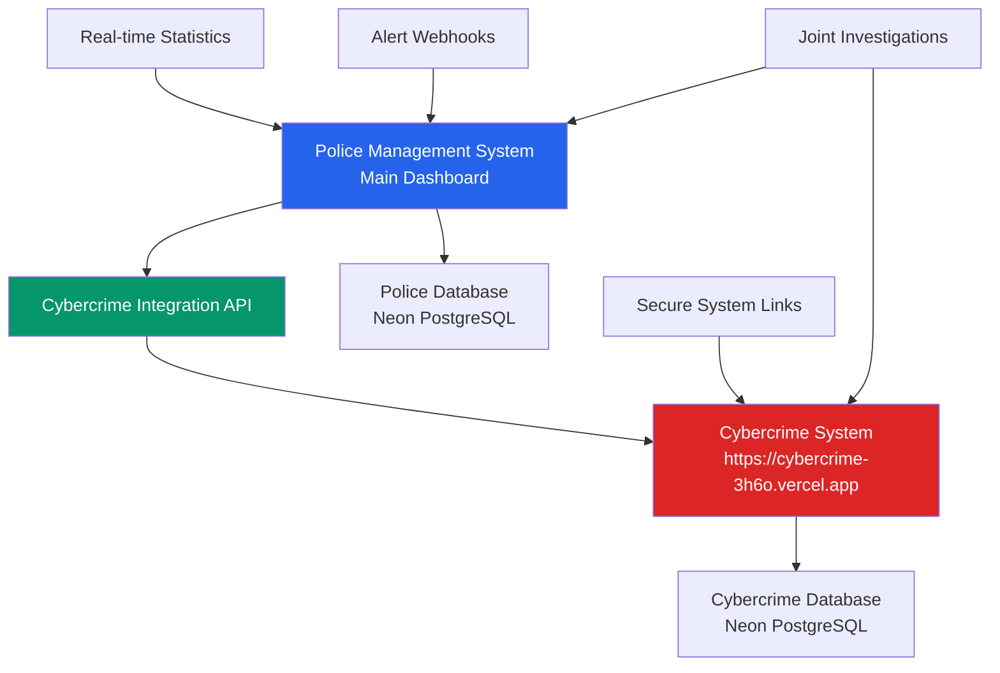

# 🔴 PNG Police System - Cybercrime Integration Guide

## Comprehensive Integration Documentation

**Version**: 1.0.0
**Last Updated**: January 2025
**Integration Type**: RESTful API with Real-time Data Sync
**Police System**: https://your-police-system.vercel.app
**Cybercrime System**: https://cybercrime-3h6o.vercel.app

---

## 📚 Table of Contents

1. [Integration Overview](#integration-overview)
2. [Architecture and Components](#architecture-and-components)
3. [API Integration Details](#api-integration-details)
4. [Dashboard Integration](#dashboard-integration)
5. [Real-time Data Synchronization](#real-time-data-synchronization)
6. [Webhook System](#webhook-system)
7. [Security and Authentication](#security-and-authentication)
8. [User Interface Integration](#user-interface-integration)
9. [Error Handling and Fallbacks](#error-handling-and-fallbacks)
10. [Monitoring and Performance](#monitoring-and-performance)
11. [Troubleshooting Guide](#troubleshooting-guide)
12. [Configuration Management](#configuration-management)

---

## 🎯 Integration Overview

### Purpose and Goals

The PNG Police Management System integrates with the specialized Cybercrime Investigation System to provide:

- **Unified Dashboard**: Real-time cybercrime statistics within the main police dashboard
- **Seamless Access**: Direct secure linking between systems
- **Data Sharing**: Bi-directional case and evidence information exchange
- **Alert System**: Real-time notifications for urgent cybercrime incidents
- **Operational Intelligence**: Combined traditional and cyber crime analytics

### Integration Benefits

```typescript
interface IntegrationBenefits {
  operational_efficiency: {
    single_interface: "Officers access both systems from one dashboard"
    real_time_updates: "Live cybercrime statistics and alerts"
    seamless_navigation: "One-click access to specialized tools"
    unified_reporting: "Combined crime statistics and trends"
  }

  investigative_capabilities: {
    cross_reference: "Link traditional crimes with cyber components"
    evidence_correlation: "Digital evidence integration with physical cases"
    pattern_recognition: "Identify cyber-physical crime patterns"
    resource_coordination: "Optimal allocation of specialized resources"
  }

  response_effectiveness: {
    faster_response: "Immediate alerts for urgent cyber threats"
    better_coordination: "Joint investigation capabilities"
    enhanced_intelligence: "Combined threat assessment"
    prevention_focus: "Proactive cybercrime prevention strategies"
  }
}
```

### System Relationship



---

## 🏗️ Architecture and Components

### Integration Architecture

#### High-Level Architecture
```typescript
interface IntegrationArchitecture {
  communication_layer: {
    protocol: "HTTPS/TLS 1.3"
    method: "RESTful API"
    authentication: "API Key Authentication"
    data_format: "JSON"
    compression: "gzip"
  }

  data_flow: {
    police_to_cybercrime: "Case linking, evidence sharing"
    cybercrime_to_police: "Statistics, alerts, threat intelligence"
    bidirectional: "Investigation updates, status changes"
    real_time: "Webhook notifications, live statistics"
  }

  security_layer: {
    encryption: "End-to-end encryption"
    authentication: "API key with rotation"
    authorization: "Role-based access control"
    validation: "Input/output validation"
    monitoring: "Access logging and audit trail"
  }
}
```

#### Component Breakdown

#### 1. Police System Components
```typescript
// Cybercrime API Service
class CybercrimeAPIService {
  private baseUrl: string = process.env.NEXT_PUBLIC_CYBERCRIME_API_URL
  private apiKey: string = process.env.CYBERCRIME_API_KEY
  private cache: Map<string, CachedData> = new Map()

  async getStatistics(): Promise<CybercrimeStats>
  async getCases(params: SearchParams): Promise<CyberCase[]>
  async getAlerts(): Promise<Alert[]>
  async linkCase(policeCase: string, cyberCase: string): Promise<boolean>
}

// Dashboard Integration Component
const CybercrimeStatsPanel = () => {
  // Real-time statistics display
  // Live data updates every 30 seconds
  // Error handling with fallback data
  // Visual indicators for system status
}

// Navigation Integration
const SidebarNavigation = () => {
  // Cybercrime Unit navigation link
  // External link with security measures
  // Visual distinction for external access
  // Session persistence across systems
}
```

#### 2. Cybercrime System Components
```typescript
// Integration API Endpoint
// /api/integration/police-system
export async function GET(request: Request) {
  // API key authentication
  // Data aggregation and formatting
  // Real-time statistics compilation
  // Response caching and optimization
}

// Webhook Endpoints
// /api/webhooks/police-system
export async function POST(request: Request) {
  // HMAC signature verification
  // Payload validation and processing
  // Database updates
  // Response confirmation
}
```

### Database Integration Model

#### Separate Database Architecture
```sql
-- Police System Database (policesystem)
Database: policesystem
Tables:
├── users (officers and personnel)
├── incidents (traditional police incidents)
├── cases (criminal cases)
├── evidence (physical and digital evidence)
├── people_involved (persons in incidents)
├── vehicles_involved (vehicles in incidents)
└── audit_logs (system activity logs)

-- Cybercrime System Database (cybercrime)
Database: cybercrime
Tables:
├── cyber_cases (cybercrime investigations)
├── digital_evidence (cyber evidence)
├── threat_intelligence (threat data)
├── social_media_monitoring (online surveillance)
├── financial_investigations (financial crimes)
├── malware_analysis (malware research)
└── case_links (links to police system cases)
```

#### Cross-System Data Mapping
```typescript
interface DataMapping {
  case_linking: {
    police_case_id: string
    cybercrime_case_id: string
    link_type: "primary" | "related" | "evidence_shared"
    created_at: string
    created_by: string
  }

  evidence_sharing: {
    evidence_id: string
    source_system: "police" | "cybercrime"
    shared_with: "police" | "cybercrime"
    sharing_level: "metadata" | "full_access" | "restricted"
    chain_of_custody: ChainEntry[]
  }

  alert_correlation: {
    alert_id: string
    source: "cybercrime_system"
    target: "police_system"
    alert_type: "urgent" | "high" | "medium" | "info"
    related_cases: string[]
    action_required: boolean
  }
}
```

---

## 🔌 API Integration Details

### Authentication System

#### API Key Authentication
```typescript
interface APIAuthentication {
  method: "Bearer Token via x-api-key header"
  key_format: "production-api-key-12345"
  rotation_schedule: "Quarterly"
  backup_keys: 2

  headers: {
    "x-api-key": "production-api-key-12345"
    "Content-Type": "application/json"
    "User-Agent": "PNG-Police-System/1.0.0"
  }

  security_measures: {
    key_encryption: "Encrypted in environment variables"
    transmission: "HTTPS only"
    validation: "Server-side key verification"
    logging: "Access logging without key exposure"
  }
}
```

#### Authentication Implementation
```typescript
// Police System - API Client Authentication
class AuthenticatedApiClient {
  private apiKey: string
  private baseUrl: string

  constructor() {
    this.apiKey = process.env.CYBERCRIME_API_KEY || ''
    this.baseUrl = process.env.NEXT_PUBLIC_CYBERCRIME_API_URL || ''
  }

  private getHeaders(): Headers {
    return new Headers({
      'x-api-key': this.apiKey,
      'Content-Type': 'application/json',
      'User-Agent': 'PNG-Police-System/1.0.0'
    })
  }

  async authenticatedRequest(endpoint: string, options: RequestInit = {}): Promise<Response> {
    const url = `${this.baseUrl}${endpoint}`

    const response = await fetch(url, {
      ...options,
      headers: {
        ...this.getHeaders(),
        ...options.headers
      }
    })

    if (response.status === 401) {
      throw new Error('Authentication failed - check API key')
    }

    return response
  }
}
```

### API Endpoints

#### Statistics Endpoint
```typescript
// GET /api/integration/police-system
interface StatisticsEndpoint {
  url: "https://cybercrime-3h6o.vercel.app/api/integration/police-system"
  method: "GET"
  authentication: "x-api-key header"
  cache_duration: 30 // seconds

  response: {
    totalCases: number
    activeCases: number
    closedCases: number
    urgentCases: number

    recentActivity: {
      newCases: number
      casesUpdated: number
      alertsGenerated: number
      evidenceProcessed: number
    }

    threatIntelligence: {
      activeThreats: number
      highRiskTargets: number
      preventedAttacks: number
      financialRecovery: number
    }

    systemStatus: {
      operationalStatus: "operational" | "degraded" | "maintenance"
      lastUpdate: string
      apiVersion: string
      responseTime: number
    }
  }
}

// Implementation
export async function GET(request: Request) {
  try {
    // Authenticate request
    const apiKey = request.headers.get('x-api-key')
    if (!isValidApiKey(apiKey)) {
      return NextResponse.json({ error: 'Unauthorized' }, { status: 401 })
    }

    // Gather real-time statistics
    const stats = await gatherCybercrimeStatistics()

    // Format response
    const response = {
      totalCases: stats.total,
      activeCases: stats.active,
      closedCases: stats.closed,
      urgentCases: stats.urgent,

      recentActivity: {
        newCases: stats.recent.new,
        casesUpdated: stats.recent.updated,
        alertsGenerated: stats.alerts.count,
        evidenceProcessed: stats.evidence.processed
      },

      threatIntelligence: {
        activeThreats: stats.threats.active,
        highRiskTargets: stats.threats.targets,
        preventedAttacks: stats.threats.prevented,
        financialRecovery: stats.financial.recovered
      },

      systemStatus: {
        operationalStatus: "operational",
        lastUpdate: new Date().toISOString(),
        apiVersion: "1.0.0",
        responseTime: Date.now() - startTime
      }
    }

    return NextResponse.json(response, {
      headers: {
        'Cache-Control': 'public, max-age=30', // 30 second cache
        'Access-Control-Allow-Origin': process.env.POLICE_SYSTEM_URL || '*'
      }
    })

  } catch (error) {
    console.error('Statistics API error:', error)
    return NextResponse.json(
      { error: 'Internal server error' },
      { status: 500 }
    )
  }
}
```

#### Cases Endpoint
```typescript
// GET /api/cases - Cybercrime case listing
interface CasesEndpoint {
  url: "https://cybercrime-3h6o.vercel.app/api/cases"
  method: "GET"
  authentication: "x-api-key header"

  parameters: {
    limit?: number         // Default: 20, Max: 100
    offset?: number        // For pagination
    status?: string        // open, investigating, closed
    priority?: string      // low, medium, high, urgent
    type?: string         // fraud, hacking, harassment, etc.
    date_from?: string    // ISO date string
    date_to?: string      // ISO date string
    search?: string       // Text search in title/description
  }

  response: {
    cases: CyberCase[]
    pagination: {
      total: number
      limit: number
      offset: number
      hasMore: boolean
    }
    filters_applied: QueryFilters
  }
}

interface CyberCase {
  id: string
  case_number: string
  title: string
  description: string
  case_type: string
  priority: 'low' | 'medium' | 'high' | 'urgent'
  status: 'open' | 'investigating' | 'under_review' | 'closed'

  date_reported: string
  date_opened: string
  date_closed?: string

  investigating_officer: string
  supervisor: string

  victim_information: {
    type: 'individual' | 'business' | 'government'
    name: string
    contact: ContactInfo
    impact_assessment: string
  }

  threat_information: {
    threat_type: string[]
    attack_vector: string[]
    estimated_damage: number
    evidence_count: number
  }

  police_system_links: {
    linked_cases: string[]
    shared_evidence: string[]
    joint_investigation: boolean
  }

  metadata: {
    created_at: string
    updated_at: string
    last_activity: string
    tags: string[]
  }
}
```

#### Case Linking Endpoint
```typescript
// POST /api/cases/link - Link police and cybercrime cases
interface CaseLinkingEndpoint {
  url: "https://cybercrime-3h6o.vercel.app/api/cases/link"
  method: "POST"
  authentication: "x-api-key header"

  request_body: {
    police_case_id: string
    cybercrime_case_id: string
    link_type: "primary" | "related" | "evidence_shared"
    linking_reason: string
    linking_officer: string
    evidence_to_share?: string[]
    access_level: "read_only" | "full_access" | "restricted"
  }

  response: {
    success: boolean
    link_id: string
    created_at: string
    permissions_granted: string[]
    next_steps: string[]
  }
}

// Implementation
export async function POST(request: Request) {
  try {
    const linkData = await request.json()

    // Validate linking request
    const validation = await validateCaseLinking(linkData)
    if (!validation.valid) {
      return NextResponse.json({ error: validation.error }, { status: 400 })
    }

    // Create bidirectional link
    const link = await createCaseLink({
      police_case_id: linkData.police_case_id,
      cybercrime_case_id: linkData.cybercrime_case_id,
      link_type: linkData.link_type,
      created_by: linkData.linking_officer,
      permissions: linkData.access_level
    })

    // Notify relevant officers
    await notifyOfficersOfLink(link)

    // Update both systems
    await updatePoliceCaseWithLink(linkData.police_case_id, link.id)
    await updateCybercaseWithLink(linkData.cybercrime_case_id, link.id)

    return NextResponse.json({
      success: true,
      link_id: link.id,
      created_at: link.created_at,
      permissions_granted: link.permissions,
      next_steps: [
        "Both investigation teams have been notified",
        "Evidence sharing protocols are now active",
        "Joint investigation procedures can be initiated"
      ]
    })

  } catch (error) {
    console.error('Case linking error:', error)
    return NextResponse.json(
      { error: 'Failed to link cases' },
      { status: 500 }
    )
  }
}
```

---

## 📊 Dashboard Integration

### Real-time Statistics Panel

#### Component Implementation
```typescript
// src/components/dashboard/cybercrime-stats.tsx
'use client'

import React, { useState, useEffect } from 'react'
import { Card, CardContent, CardHeader, CardTitle } from '@/components/ui/card'
import { Button } from '@/components/ui/button'
import { Badge } from '@/components/ui/badge'
import { Monitor, AlertTriangle, Shield, TrendingUp, ExternalLink } from 'lucide-react'

interface CybercrimeStats {
  activeCases: number
  suspiciousActivities: number
  digitalEvidenceItems: number
  onlineInvestigators: number
  avgResponseTime: string
  systemStatus: 'operational' | 'degraded' | 'maintenance'
  lastUpdated: string

  recentAlerts: Alert[]
  threatLevel: 'low' | 'medium' | 'high' | 'critical'
  financialRecovery: number
  preventedAttacks: number
}

interface Alert {
  id: string
  type: 'phishing' | 'fraud' | 'cyberbullying' | 'hacking' | 'ransomware'
  severity: 'low' | 'medium' | 'high' | 'critical'
  title: string
  timestamp: string
  status: 'new' | 'investigating' | 'resolved'
}

export function CybercrimeStatsPanel() {
  const [stats, setStats] = useState<CybercrimeStats | null>(null)
  const [loading, setLoading] = useState(true)
  const [error, setError] = useState<string | null>(null)
  const [lastFetch, setLastFetch] = useState<Date>(new Date())

  // Fetch cybercrime statistics
  const fetchStats = async () => {
    try {
      const response = await fetch('/api/cybercrime/stats')

      if (!response.ok) {
        throw new Error(`API Error: ${response.status}`)
      }

      const data = await response.json()
      setStats(data)
      setError(null)
      setLastFetch(new Date())
    } catch (err) {
      console.error('Failed to fetch cybercrime stats:', err)
      setError(err instanceof Error ? err.message : 'Unknown error')

      // Use fallback data if API fails
      setStats({
        activeCases: 12,
        suspiciousActivities: 8,
        digitalEvidenceItems: 34,
        onlineInvestigators: 6,
        avgResponseTime: '4.2h',
        systemStatus: 'operational',
        lastUpdated: new Date().toISOString(),
        recentAlerts: [],
        threatLevel: 'medium',
        financialRecovery: 125000,
        preventedAttacks: 23
      })
    } finally {
      setLoading(false)
    }
  }

  // Auto-refresh every 30 seconds
  useEffect(() => {
    fetchStats()

    const interval = setInterval(fetchStats, 30000)
    return () => clearInterval(interval)
  }, [])

  // Get status color based on system status
  const getStatusColor = (status: string) => {
    switch (status) {
      case 'operational': return 'bg-green-500'
      case 'degraded': return 'bg-yellow-500'
      case 'maintenance': return 'bg-blue-500'
      default: return 'bg-gray-500'
    }
  }

  // Get threat level styling
  const getThreatLevelStyle = (level: string) => {
    switch (level) {
      case 'low': return 'bg-green-100 text-green-800'
      case 'medium': return 'bg-yellow-100 text-yellow-800'
      case 'high': return 'bg-orange-100 text-orange-800'
      case 'critical': return 'bg-red-100 text-red-800'
      default: return 'bg-gray-100 text-gray-800'
    }
  }

  if (loading) {
    return (
      <Card className="border-red-200 bg-red-50">
        <CardHeader className="pb-3">
          <CardTitle className="text-red-800 flex items-center gap-2">
            <Monitor className="h-5 w-5" />
            Cybercrime Unit Integration
          </CardTitle>
        </CardHeader>
        <CardContent>
          <div className="animate-pulse">
            <div className="h-4 bg-red-200 rounded w-3/4 mb-2"></div>
            <div className="h-4 bg-red-200 rounded w-1/2"></div>
          </div>
        </CardContent>
      </Card>
    )
  }

  return (
    <Card className="border-red-200 bg-red-50">
      <CardHeader className="pb-3">
        <CardTitle className="text-red-800 flex items-center justify-between">
          <div className="flex items-center gap-2">
            <Monitor className="h-5 w-5" />
            Cybercrime Unit Integration
          </div>
          <div className="flex items-center gap-2">
            <div className={`w-2 h-2 rounded-full ${getStatusColor(stats?.systemStatus || 'operational')}`}></div>
            <span className="text-sm text-red-600">
              {stats?.systemStatus === 'operational' ? 'Online' : stats?.systemStatus}
            </span>
          </div>
        </CardTitle>
      </CardHeader>

      <CardContent className="space-y-4">
        {error && (
          <div className="bg-yellow-100 border border-yellow-400 text-yellow-700 px-3 py-2 rounded-md text-sm">
            <div className="flex items-center gap-2">
              <AlertTriangle className="h-4 w-4" />
              API Connection Issue - Showing Cached Data
            </div>
          </div>
        )}

        {/* Real-time Statistics Grid */}
        <div className="grid grid-cols-2 md:grid-cols-4 gap-3">
          <div className="bg-white p-3 rounded-md border border-red-200">
            <div className="text-2xl font-bold text-red-800">{stats?.activeCases || 0}</div>
            <div className="text-xs text-red-600">Active Cases</div>
          </div>

          <div className="bg-white p-3 rounded-md border border-red-200">
            <div className="text-2xl font-bold text-red-800">{stats?.suspiciousActivities || 0}</div>
            <div className="text-xs text-red-600">Suspicious Activities</div>
          </div>

          <div className="bg-white p-3 rounded-md border border-red-200">
            <div className="text-2xl font-bold text-red-800">{stats?.digitalEvidenceItems || 0}</div>
            <div className="text-xs text-red-600">Digital Evidence</div>
          </div>

          <div className="bg-white p-3 rounded-md border border-red-200">
            <div className="text-2xl font-bold text-red-800">{stats?.onlineInvestigators || 0}</div>
            <div className="text-xs text-red-600">Online Investigators</div>
          </div>
        </div>

        {/* Performance Metrics */}
        <div className="grid grid-cols-2 gap-3">
          <div className="bg-white p-3 rounded-md border border-red-200">
            <div className="flex items-center gap-2">
              <TrendingUp className="h-4 w-4 text-red-600" />
              <span className="text-sm text-red-800">Avg Response Time</span>
            </div>
            <div className="text-lg font-semibold text-red-800">{stats?.avgResponseTime || 'N/A'}</div>
          </div>

          <div className="bg-white p-3 rounded-md border border-red-200">
            <div className="flex items-center gap-2">
              <Shield className="h-4 w-4 text-red-600" />
              <span className="text-sm text-red-800">Threat Level</span>
            </div>
            <Badge className={getThreatLevelStyle(stats?.threatLevel || 'medium')}>
              {stats?.threatLevel?.toUpperCase() || 'MEDIUM'}
            </Badge>
          </div>
        </div>

        {/* Recent Alerts */}
        {stats?.recentAlerts && stats.recentAlerts.length > 0 && (
          <div className="bg-white p-3 rounded-md border border-red-200">
            <h4 className="font-semibold text-red-800 mb-2">Recent Alerts</h4>
            <div className="space-y-1">
              {stats.recentAlerts.slice(0, 3).map(alert => (
                <div key={alert.id} className="flex items-center justify-between text-sm">
                  <span className="text-red-700">{alert.title}</span>
                  <Badge variant={alert.severity === 'critical' ? 'destructive' : 'secondary'}>
                    {alert.severity}
                  </Badge>
                </div>
              ))}
            </div>
          </div>
        )}

        {/* Integration Status */}
        <div className="bg-white p-3 rounded-md border border-red-200">
          <div className="grid grid-cols-2 gap-4 text-sm">
            <div>
              <span className="text-red-600">Data Sync:</span>
              <span className="ml-2 text-green-600 font-medium">Active</span>
            </div>
            <div>
              <span className="text-red-600">API Status:</span>
              <span className="ml-2 text-green-600 font-medium">Connected</span>
            </div>
          </div>
          <div className="mt-2 text-xs text-red-500">
            Last Updated: {new Date(lastFetch).toLocaleTimeString()}
          </div>
        </div>

        {/* Access Button */}
        <Button
          className="w-full bg-red-600 hover:bg-red-700 text-white"
          onClick={() => window.open('https://cybercrime-3h6o.vercel.app', '_blank')}
        >
          <ExternalLink className="h-4 w-4 mr-2" />
          Access Cybercrime System
        </Button>
      </CardContent>
    </Card>
  )
}
```

### Navigation Integration

#### Sidebar Navigation Enhancement
```typescript
// src/components/layout/dashboard-layout.tsx
const navigationItems = [
  // ... existing navigation items

  {
    name: 'Cybercrime Unit',
    href: 'https://cybercrime-3h6o.vercel.app',
    icon: Monitor,
    external: true,
    className: 'text-red-600 hover:text-red-700 hover:bg-red-50',
    badge: 'External',
    badgeVariant: 'destructive' as const,
    description: 'Access specialized cybercrime investigation tools'
  }
]

// Navigation item rendering with external link handling
const NavigationItem = ({ item }: { item: NavigationItem }) => {
  const handleClick = (e: React.MouseEvent) => {
    if (item.external) {
      e.preventDefault()
      window.open(item.href, '_blank', 'noopener,noreferrer')
    }
  }

  return (
    <a
      href={item.href}
      onClick={handleClick}
      className={cn(
        'group flex items-center px-2 py-2 text-sm font-medium rounded-md',
        item.className || 'text-gray-600 hover:bg-gray-50 hover:text-gray-900'
      )}
      target={item.external ? '_blank' : undefined}
      rel={item.external ? 'noopener noreferrer' : undefined}
    >
      <item.icon
        className="mr-3 h-5 w-5 flex-shrink-0"
        aria-hidden="true"
      />
      <span className="flex-1">{item.name}</span>

      {item.badge && (
        <Badge variant={item.badgeVariant || 'secondary'} className="ml-2 text-xs">
          {item.badge}
        </Badge>
      )}

      {item.external && (
        <ExternalLink className="ml-2 h-4 w-4 opacity-50" />
      )}
    </a>
  )
}
```

---

## 🔄 Real-time Data Synchronization

### Polling Strategy

#### Client-Side Polling Implementation
```typescript
// Real-time data synchronization service
class CybercrimeDataSync {
  private pollingInterval: number = 30000 // 30 seconds
  private retryCount: number = 0
  private maxRetries: number = 5
  private isPolling: boolean = false
  private listeners: Map<string, Function[]> = new Map()

  constructor() {
    this.startPolling()
  }

  // Start automatic polling
  startPolling(): void {
    if (this.isPolling) return

    this.isPolling = true
    this.poll()
  }

  // Stop polling
  stopPolling(): void {
    this.isPolling = false
  }

  // Subscribe to data updates
  subscribe(eventType: string, callback: Function): () => void {
    if (!this.listeners.has(eventType)) {
      this.listeners.set(eventType, [])
    }

    this.listeners.get(eventType)!.push(callback)

    // Return unsubscribe function
    return () => {
      const callbacks = this.listeners.get(eventType) || []
      const index = callbacks.indexOf(callback)
      if (index > -1) {
        callbacks.splice(index, 1)
      }
    }
  }

  // Emit events to subscribers
  private emit(eventType: string, data: any): void {
    const callbacks = this.listeners.get(eventType) || []
    callbacks.forEach(callback => {
      try {
        callback(data)
      } catch (error) {
        console.error(`Error in ${eventType} callback:`, error)
      }
    })
  }

  // Main polling function
  private async poll(): Promise<void> {
    if (!this.isPolling) return

    try {
      // Fetch latest cybercrime data
      const response = await fetch('/api/cybercrime/stats')

      if (!response.ok) {
        throw new Error(`HTTP ${response.status}`)
      }

      const data = await response.json()

      // Emit updates to subscribers
      this.emit('statistics_updated', data)
      this.emit('sync_success', { timestamp: new Date() })

      // Reset retry count on success
      this.retryCount = 0

    } catch (error) {
      console.error('Polling error:', error)
      this.retryCount++

      this.emit('sync_error', {
        error: error instanceof Error ? error.message : 'Unknown error',
        retryCount: this.retryCount,
        maxRetries: this.maxRetries
      })

      // Stop polling if max retries reached
      if (this.retryCount >= this.maxRetries) {
        this.isPolling = false
        this.emit('sync_failed', {
          message: 'Max retries reached, stopping automatic sync'
        })
        return
      }
    }

    // Schedule next poll with exponential backoff on errors
    const delay = this.retryCount > 0
      ? Math.min(this.pollingInterval * Math.pow(2, this.retryCount - 1), 300000) // Max 5 minutes
      : this.pollingInterval

    setTimeout(() => this.poll(), delay)
  }

  // Manual refresh
  async refresh(): Promise<void> {
    this.retryCount = 0
    await this.poll()
  }

  // Get current status
  getStatus(): SyncStatus {
    return {
      isPolling: this.isPolling,
      retryCount: this.retryCount,
      maxRetries: this.maxRetries,
      lastPoll: this.lastPoll,
      nextPoll: this.isPolling ? new Date(Date.now() + this.pollingInterval) : null
    }
  }
}

interface SyncStatus {
  isPolling: boolean
  retryCount: number
  maxRetries: number
  lastPoll?: Date
  nextPoll?: Date | null
}

// Global sync instance
export const cybercrimeSync = new CybercrimeDataSync()
```

#### React Hook for Data Synchronization
```typescript
// Custom hook for cybercrime data with automatic updates
import { useState, useEffect, useCallback } from 'react'
import { cybercrimeSync } from '@/lib/cybercrime-sync'

export function useCybercrimeData() {
  const [data, setData] = useState<CybercrimeStats | null>(null)
  const [loading, setLoading] = useState(true)
  const [error, setError] = useState<string | null>(null)
  const [lastUpdated, setLastUpdated] = useState<Date | null>(null)
  const [syncStatus, setSyncStatus] = useState<SyncStatus | null>(null)

  // Handle data updates
  const handleDataUpdate = useCallback((newData: CybercrimeStats) => {
    setData(newData)
    setLastUpdated(new Date())
    setLoading(false)
    setError(null)
  }, [])

  // Handle sync errors
  const handleSyncError = useCallback((errorInfo: any) => {
    setError(errorInfo.error)
    setLoading(false)
  }, [])

  // Handle sync success
  const handleSyncSuccess = useCallback((info: any) => {
    setError(null)
    setSyncStatus(cybercrimeSync.getStatus())
  }, [])

  // Manual refresh function
  const refresh = useCallback(async () => {
    setLoading(true)
    setError(null)
    await cybercrimeSync.refresh()
  }, [])

  useEffect(() => {
    // Subscribe to data updates
    const unsubscribeData = cybercrimeSync.subscribe('statistics_updated', handleDataUpdate)
    const unsubscribeError = cybercrimeSync.subscribe('sync_error', handleSyncError)
    const unsubscribeSuccess = cybercrimeSync.subscribe('sync_success', handleSyncSuccess)

    // Get initial status
    setSyncStatus(cybercrimeSync.getStatus())

    // Cleanup subscriptions
    return () => {
      unsubscribeData()
      unsubscribeError()
      unsubscribeSuccess()
    }
  }, [handleDataUpdate, handleSyncError, handleSyncSuccess])

  return {
    data,
    loading,
    error,
    lastUpdated,
    syncStatus,
    refresh
  }
}
```

### Caching Strategy

#### Multi-Level Caching
```typescript
interface CacheStrategy {
  browser_cache: {
    type: "localStorage with TTL"
    duration: 60000 // 1 minute
    key_prefix: "cybercrime_cache_"
    max_size: "1MB"
  }

  api_cache: {
    type: "Server-side memory cache"
    duration: 30000 // 30 seconds
    invalidation: "time_based"
    fallback: "stale_while_revalidate"
  }

  cdn_cache: {
    type: "Vercel Edge Cache"
    duration: 30000 // 30 seconds
    headers: "Cache-Control: public, max-age=30"
    purging: "webhook_triggered"
  }
}

// Cache implementation
class CybercrimeCache {
  private cache: Map<string, CacheEntry> = new Map()
  private readonly TTL = 60000 // 1 minute

  set(key: string, data: any): void {
    const entry: CacheEntry = {
      data,
      timestamp: Date.now(),
      ttl: this.TTL
    }

    this.cache.set(key, entry)

    // Store in localStorage for persistence
    try {
      localStorage.setItem(
        `cybercrime_cache_${key}`,
        JSON.stringify(entry)
      )
    } catch (error) {
      console.warn('Failed to store in localStorage:', error)
    }
  }

  get(key: string): any | null {
    // Check memory cache first
    let entry = this.cache.get(key)

    // Fallback to localStorage
    if (!entry) {
      try {
        const stored = localStorage.getItem(`cybercrime_cache_${key}`)
        if (stored) {
          entry = JSON.parse(stored)
          this.cache.set(key, entry!)
        }
      } catch (error) {
        console.warn('Failed to read from localStorage:', error)
      }
    }

    if (!entry) return null

    // Check if expired
    if (Date.now() - entry.timestamp > entry.ttl) {
      this.delete(key)
      return null
    }

    return entry.data
  }

  delete(key: string): void {
    this.cache.delete(key)
    localStorage.removeItem(`cybercrime_cache_${key}`)
  }

  clear(): void {
    this.cache.clear()

    // Clear localStorage entries
    for (let i = localStorage.length - 1; i >= 0; i--) {
      const key = localStorage.key(i)
      if (key && key.startsWith('cybercrime_cache_')) {
        localStorage.removeItem(key)
      }
    }
  }
}

interface CacheEntry {
  data: any
  timestamp: number
  ttl: number
}

export const cybercrimeCache = new CybercrimeCache()
```

---

## 🔗 Webhook System

### Webhook Architecture

#### Incoming Webhooks (Police System Receives)
```typescript
// /api/webhooks/cybercrime/route.ts
import crypto from 'crypto'
import { NextRequest, NextResponse } from 'next/server'

export async function POST(request: NextRequest) {
  try {
    // Get request body and signature
    const payload = await request.text()
    const signature = request.headers.get('x-signature-256')
    const timestamp = request.headers.get('x-timestamp')

    // Verify webhook authenticity
    if (!verifyWebhookSignature(payload, signature, timestamp)) {
      return NextResponse.json(
        { error: 'Invalid webhook signature' },
        { status: 401 }
      )
    }

    // Parse webhook data
    const webhookData = JSON.parse(payload)

    // Process different webhook types
    switch (webhookData.type) {
      case 'urgent_alert':
        await handleUrgentAlert(webhookData.data)
        break

      case 'case_update':
        await handleCaseUpdate(webhookData.data)
        break

      case 'threat_intelligence':
        await handleThreatIntelligence(webhookData.data)
        break

      case 'system_status':
        await handleSystemStatus(webhookData.data)
        break

      default:
        console.warn('Unknown webhook type:', webhookData.type)
    }

    // Acknowledge receipt
    return NextResponse.json({
      success: true,
      processed_at: new Date().toISOString(),
      webhook_id: webhookData.id
    })

  } catch (error) {
    console.error('Webhook processing error:', error)
    return NextResponse.json(
      { error: 'Webhook processing failed' },
      { status: 500 }
    )
  }
}

// Webhook signature verification
function verifyWebhookSignature(
  payload: string,
  signature: string | null,
  timestamp: string | null
): boolean {
  if (!signature || !timestamp) return false

  const secret = process.env.CYBERCRIME_WEBHOOK_SECRET
  if (!secret) return false

  // Check timestamp (prevent replay attacks)
  const webhookTimestamp = parseInt(timestamp)
  const currentTime = Date.now()
  const timeDiff = Math.abs(currentTime - webhookTimestamp)

  if (timeDiff > 300000) { // 5 minutes tolerance
    console.warn('Webhook timestamp too old')
    return false
  }

  // Verify HMAC signature
  const expectedSignature = crypto
    .createHmac('sha256', secret)
    .update(timestamp + payload)
    .digest('hex')

  return `sha256=${expectedSignature}` === signature
}

// Webhook handlers
async function handleUrgentAlert(alertData: UrgentAlert): Promise<void> {
  console.log('Processing urgent cybercrime alert:', alertData)

  try {
    // Store alert in database
    await storeAlert(alertData)

    // Notify relevant officers
    await notifyOfficers(alertData)

    // Update dashboard with new alert
    await updateDashboardAlerts(alertData)

    // Log for audit trail
    await logWebhookActivity('urgent_alert', alertData.id, 'processed')

  } catch (error) {
    console.error('Failed to process urgent alert:', error)
    await logWebhookActivity('urgent_alert', alertData.id, 'failed', error)
  }
}

async function handleCaseUpdate(updateData: CaseUpdate): Promise<void> {
  console.log('Processing case update:', updateData)

  try {
    // Update linked case if exists
    if (updateData.police_case_link) {
      await updateLinkedCase(updateData.police_case_link, updateData)
    }

    // Refresh dashboard statistics
    await refreshDashboardStats()

    // Notify case officers
    await notifyCaseOfficers(updateData)

    await logWebhookActivity('case_update', updateData.case_id, 'processed')

  } catch (error) {
    console.error('Failed to process case update:', error)
    await logWebhookActivity('case_update', updateData.case_id, 'failed', error)
  }
}

interface UrgentAlert {
  id: string
  type: 'critical_threat' | 'ongoing_attack' | 'data_breach' | 'child_safety'
  severity: 'high' | 'critical'
  title: string
  description: string
  affected_systems: string[]
  recommended_actions: string[]
  timestamp: string
  expires_at?: string
}

interface CaseUpdate {
  case_id: string
  police_case_link?: string
  status: string
  priority: string
  summary: string
  evidence_updates: EvidenceUpdate[]
  officer_assigned: string
  timestamp: string
}
```

#### Outgoing Webhooks (Police System Sends)
```typescript
// Webhook sender service for notifying cybercrime system
class WebhookSender {
  private cybercrimeWebhookUrl: string
  private secret: string

  constructor() {
    this.cybercrimeWebhookUrl = process.env.CYBERCRIME_WEBHOOK_URL || ''
    this.secret = process.env.CYBERCRIME_WEBHOOK_SECRET || ''
  }

  async sendWebhook(type: string, data: any, retries: number = 3): Promise<boolean> {
    const payload = {
      id: crypto.randomUUID(),
      type,
      data,
      timestamp: Date.now(),
      source: 'police_system'
    }

    const payloadString = JSON.stringify(payload)
    const signature = this.generateSignature(payloadString, payload.timestamp)

    for (let attempt = 1; attempt <= retries; attempt++) {
      try {
        const response = await fetch(this.cybercrimeWebhookUrl, {
          method: 'POST',
          headers: {
            'Content-Type': 'application/json',
            'x-signature-256': signature,
            'x-timestamp': payload.timestamp.toString(),
            'User-Agent': 'PNG-Police-System-Webhook/1.0.0'
          },
          body: payloadString
        })

        if (response.ok) {
          console.log(`Webhook sent successfully: ${type}`)
          return true
        } else {
          console.error(`Webhook failed (attempt ${attempt}): HTTP ${response.status}`)
        }
      } catch (error) {
        console.error(`Webhook error (attempt ${attempt}):`, error)
      }

      // Wait before retry (exponential backoff)
      if (attempt < retries) {
        await new Promise(resolve => setTimeout(resolve, Math.pow(2, attempt) * 1000))
      }
    }

    console.error(`Webhook failed after ${retries} attempts: ${type}`)
    return false
  }

  private generateSignature(payload: string, timestamp: number): string {
    return 'sha256=' + crypto
      .createHmac('sha256', this.secret)
      .update(timestamp + payload)
      .digest('hex')
  }

  // Specific webhook methods
  async notifyCaseLinked(policeCase: string, cyberCase: string): Promise<boolean> {
    return this.sendWebhook('case_linked', {
      police_case_id: policeCase,
      cybercrime_case_id: cyberCase,
      linked_at: new Date().toISOString()
    })
  }

  async notifyEvidenceShared(evidenceId: string, caseId: string): Promise<boolean> {
    return this.sendWebhook('evidence_shared', {
      evidence_id: evidenceId,
      case_id: caseId,
      shared_at: new Date().toISOString()
    })
  }

  async notifyOfficerUpdate(update: any): Promise<boolean> {
    return this.sendWebhook('officer_update', update)
  }
}

export const webhookSender = new WebhookSender()
```

### Webhook Security

#### Security Implementation
```typescript
interface WebhookSecurity {
  signature_verification: {
    algorithm: "HMAC-SHA256"
    header: "x-signature-256"
    timestamp_header: "x-timestamp"
    timestamp_tolerance: 300 // seconds
  }

  replay_protection: {
    timestamp_validation: true
    nonce_tracking: true
    request_id_validation: true
  }

  rate_limiting: {
    max_requests_per_minute: 60
    burst_allowance: 10
    progressive_delays: true
  }

  error_handling: {
    retry_attempts: 3
    exponential_backoff: true
    dead_letter_queue: true
    alert_on_failure: true
  }
}

// Enhanced webhook security implementation
class SecureWebhookHandler {
  private processedWebhooks: Set<string> = new Set()
  private rateLimiter: Map<string, number[]> = new Map()

  async processWebhook(request: NextRequest): Promise<NextResponse> {
    try {
      // 1. Rate limiting check
      const clientIP = this.getClientIP(request)
      if (!this.checkRateLimit(clientIP)) {
        return NextResponse.json(
          { error: 'Rate limit exceeded' },
          { status: 429 }
        )
      }

      // 2. Extract and validate headers
      const signature = request.headers.get('x-signature-256')
      const timestamp = request.headers.get('x-timestamp')
      const requestId = request.headers.get('x-request-id')

      if (!signature || !timestamp) {
        return NextResponse.json(
          { error: 'Missing required headers' },
          { status: 400 }
        )
      }

      // 3. Replay protection
      if (requestId && this.processedWebhooks.has(requestId)) {
        return NextResponse.json(
          { error: 'Duplicate request' },
          { status: 409 }
        )
      }

      // 4. Get and verify payload
      const payload = await request.text()

      if (!this.verifySignature(payload, signature, timestamp)) {
        return NextResponse.json(
          { error: 'Invalid signature' },
          { status: 401 }
        )
      }

      // 5. Mark as processed (replay protection)
      if (requestId) {
        this.processedWebhooks.add(requestId)

        // Clean up old request IDs (keep last 1000)
        if (this.processedWebhooks.size > 1000) {
          const oldestIds = Array.from(this.processedWebhooks).slice(0, 100)
          oldestIds.forEach(id => this.processedWebhooks.delete(id))
        }
      }

      // 6. Process webhook
      const webhookData = JSON.parse(payload)
      await this.handleWebhookData(webhookData)

      return NextResponse.json({ success: true })

    } catch (error) {
      console.error('Webhook processing error:', error)
      return NextResponse.json(
        { error: 'Processing failed' },
        { status: 500 }
      )
    }
  }

  private checkRateLimit(clientIP: string): boolean {
    const now = Date.now()
    const windowStart = now - 60000 // 1 minute window

    let requests = this.rateLimiter.get(clientIP) || []
    requests = requests.filter(time => time > windowStart)

    if (requests.length >= 60) { // 60 requests per minute
      return false
    }

    requests.push(now)
    this.rateLimiter.set(clientIP, requests)

    return true
  }

  private verifySignature(
    payload: string,
    signature: string,
    timestamp: string
  ): boolean {
    // Timestamp validation
    const webhookTime = parseInt(timestamp)
    const currentTime = Date.now()

    if (Math.abs(currentTime - webhookTime) > 300000) { // 5 minutes
      console.warn('Webhook timestamp outside tolerance')
      return false
    }

    // Signature verification
    const secret = process.env.CYBERCRIME_WEBHOOK_SECRET
    if (!secret) {
      console.error('Webhook secret not configured')
      return false
    }

    const expectedSignature = crypto
      .createHmac('sha256', secret)
      .update(timestamp + payload)
      .digest('hex')

    return crypto.timingSafeEqual(
      Buffer.from(`sha256=${expectedSignature}`),
      Buffer.from(signature)
    )
  }

  private getClientIP(request: NextRequest): string {
    return request.headers.get('x-forwarded-for')?.split(',')[0] ||
           request.headers.get('x-real-ip') ||
           'unknown'
  }
}
```

---

## 🔒 Security and Authentication

### API Key Management

#### Key Rotation Strategy
```typescript
interface APIKeyManagement {
  primary_key: {
    current: "production-api-key-12345"
    rotation_schedule: "quarterly"
    next_rotation: "2025-04-01"
    backup_keys: ["backup-api-key-1", "backup-api-key-2"]
  }

  rotation_process: {
    steps: [
      "Generate new API key",
      "Update cybercrime system with new key",
      "Test integration with new key",
      "Update police system environment variables",
      "Deploy police system with new key",
      "Verify integration functionality",
      "Deactivate old key after 24 hours"
    ]
  }

  key_security: {
    generation: "Cryptographically secure random"
    length: 32 // characters
    format: "production-api-key-[random]"
    storage: "Encrypted environment variables"
    transmission: "HTTPS only"
  }
}

// API key rotation service
class APIKeyRotationService {
  async rotateKeys(): Promise<void> {
    console.log('Starting API key rotation process...')

    try {
      // 1. Generate new API key
      const newKey = this.generateAPIKey()
      console.log('New API key generated')

      // 2. Test new key with cybercrime system
      const isValid = await this.testAPIKey(newKey)
      if (!isValid) {
        throw new Error('New API key validation failed')
      }

      // 3. Update environment variables
      await this.updateEnvironmentVariable('CYBERCRIME_API_KEY', newKey)
      console.log('Environment variables updated')

      // 4. Trigger deployment
      await this.triggerDeployment()
      console.log('Deployment triggered')

      // 5. Verify integration after deployment
      await this.verifyIntegration()
      console.log('Integration verified')

      // 6. Schedule old key deactivation
      setTimeout(() => this.deactivateOldKey(), 24 * 60 * 60 * 1000) // 24 hours

      console.log('API key rotation completed successfully')

    } catch (error) {
      console.error('API key rotation failed:', error)
      throw error
    }
  }

  private generateAPIKey(): string {
    const randomBytes = crypto.randomBytes(16)
    const randomString = randomBytes.toString('hex')
    return `production-api-key-${randomString}`
  }

  private async testAPIKey(apiKey: string): Promise<boolean> {
    try {
      const response = await fetch(
        `${process.env.NEXT_PUBLIC_CYBERCRIME_API_URL}/api/integration/police-system`,
        {
          headers: {
            'x-api-key': apiKey,
            'Content-Type': 'application/json'
          }
        }
      )

      return response.ok
    } catch (error) {
      console.error('API key test failed:', error)
      return false
    }
  }

  private async updateEnvironmentVariable(name: string, value: string): Promise<void> {
    // This would integrate with Vercel API to update environment variables
    // For now, this is a placeholder for the manual process
    console.log(`Update ${name} in Vercel dashboard with new value`)
  }

  private async triggerDeployment(): Promise<void> {
    // This would trigger a new deployment via Vercel API
    // For now, this is a placeholder
    console.log('Trigger new deployment in Vercel dashboard')
  }

  private async verifyIntegration(): Promise<void> {
    // Wait for deployment to complete
    await new Promise(resolve => setTimeout(resolve, 30000)) // 30 seconds

    // Test integration
    const response = await fetch('/api/cybercrime/stats')
    if (!response.ok) {
      throw new Error('Integration verification failed')
    }
  }

  private async deactivateOldKey(): Promise<void> {
    console.log('Deactivating old API key')
    // This would notify the cybercrime system to deactivate the old key
  }
}
```

### Access Control

#### Role-Based Integration Access
```typescript
interface IntegrationAccessControl {
  roles: {
    commander: {
      cybercrime_access: "full"
      can_link_cases: true
      can_view_statistics: true
      can_access_external_system: true
      can_receive_alerts: true
    }

    officer: {
      cybercrime_access: "limited"
      can_link_cases: false
      can_view_statistics: true
      can_access_external_system: true
      can_receive_alerts: true
    }

    analyst: {
      cybercrime_access: "read_only"
      can_link_cases: false
      can_view_statistics: true
      can_access_external_system: false
      can_receive_alerts: false
    }

    admin: {
      cybercrime_access: "full"
      can_link_cases: true
      can_view_statistics: true
      can_access_external_system: true
      can_receive_alerts: true
      can_manage_integration: true
    }
  }
}

// Access control middleware
function checkCybercrimeAccess(requiredPermission: string) {
  return (req: NextRequest, user: User) => {
    const userRole = user.role
    const permissions = IntegrationAccessControl.roles[userRole]

    if (!permissions) {
      throw new Error('Invalid user role')
    }

    switch (requiredPermission) {
      case 'view_statistics':
        return permissions.can_view_statistics

      case 'link_cases':
        return permissions.can_link_cases

      case 'access_external':
        return permissions.can_access_external_system

      case 'manage_integration':
        return permissions.can_manage_integration || false

      default:
        return false
    }
  }
}

// Protected cybercrime API routes
export async function GET(request: NextRequest) {
  try {
    // Get current user from session
    const user = await getCurrentUser(request)

    // Check cybercrime access permission
    if (!checkCybercrimeAccess('view_statistics')(request, user)) {
      return NextResponse.json(
        { error: 'Insufficient permissions for cybercrime data' },
        { status: 403 }
      )
    }

    // Proceed with data fetching
    const stats = await fetchCybercrimeStatistics()
    return NextResponse.json(stats)

  } catch (error) {
    return NextResponse.json(
      { error: 'Access denied' },
      { status: 401 }
    )
  }
}
```

### Audit and Logging

#### Integration Activity Logging
```typescript
interface IntegrationAuditLog {
  log_id: string
  timestamp: string
  user_id: string
  user_role: string
  action: string
  resource: string
  details: Record<string, any>
  ip_address: string
  user_agent: string
  success: boolean
  error_message?: string
}

class IntegrationAuditLogger {
  async logActivity(
    userId: string,
    action: string,
    resource: string,
    details: any = {},
    request: NextRequest,
    success: boolean = true,
    error?: string
  ): Promise<void> {
    const logEntry: IntegrationAuditLog = {
      log_id: crypto.randomUUID(),
      timestamp: new Date().toISOString(),
      user_id: userId,
      user_role: await this.getUserRole(userId),
      action,
      resource,
      details,
      ip_address: this.getClientIP(request),
      user_agent: request.headers.get('user-agent') || 'unknown',
      success,
      error_message: error
    }

    try {
      // Store in database
      await this.storeAuditLog(logEntry)

      // Send to monitoring system if error
      if (!success) {
        await this.alertOnError(logEntry)
      }

    } catch (logError) {
      console.error('Failed to log audit entry:', logError)
    }
  }

  async logCybercrimeAPICall(
    userId: string,
    endpoint: string,
    method: string,
    responseStatus: number,
    responseTime: number,
    request: NextRequest
  ): Promise<void> {
    await this.logActivity(
      userId,
      'cybercrime_api_call',
      endpoint,
      {
        method,
        response_status: responseStatus,
        response_time_ms: responseTime
      },
      request,
      responseStatus < 400
    )
  }

  async logCaseLinking(
    userId: string,
    policeCase: string,
    cyberCase: string,
    request: NextRequest
  ): Promise<void> {
    await this.logActivity(
      userId,
      'case_linking',
      'case_link',
      {
        police_case_id: policeCase,
        cybercrime_case_id: cyberCase
      },
      request
    )
  }

  async logSystemAccess(
    userId: string,
    targetSystem: string,
    request: NextRequest
  ): Promise<void> {
    await this.logActivity(
      userId,
      'external_system_access',
      targetSystem,
      {
        target_url: targetSystem === 'cybercrime' ?
          process.env.NEXT_PUBLIC_CYBERCRIME_SYSTEM_URL :
          'unknown'
      },
      request
    )
  }

  private async storeAuditLog(logEntry: IntegrationAuditLog): Promise<void> {
    // Store in database
    await sql`
      INSERT INTO integration_audit_logs (
        log_id, timestamp, user_id, user_role, action, resource,
        details, ip_address, user_agent, success, error_message
      ) VALUES (
        ${logEntry.log_id}, ${logEntry.timestamp}, ${logEntry.user_id},
        ${logEntry.user_role}, ${logEntry.action}, ${logEntry.resource},
        ${JSON.stringify(logEntry.details)}, ${logEntry.ip_address},
        ${logEntry.user_agent}, ${logEntry.success}, ${logEntry.error_message}
      )
    `
  }

  private async alertOnError(logEntry: IntegrationAuditLog): Promise<void> {
    // Send alert for failed integration activities
    console.error('Integration error:', logEntry)

    // Could integrate with alerting service
    // await alertingService.sendAlert('integration_error', logEntry)
  }

  private getClientIP(request: NextRequest): string {
    return request.headers.get('x-forwarded-for')?.split(',')[0] ||
           request.headers.get('x-real-ip') ||
           'unknown'
  }

  private async getUserRole(userId: string): Promise<string> {
    try {
      const result = await sql`
        SELECT role FROM users WHERE badge_number = ${userId}
      `
      return result.rows[0]?.role || 'unknown'
    } catch (error) {
      return 'unknown'
    }
  }
}

export const integrationAuditLogger = new IntegrationAuditLogger()
```

---

*[Continue reading the full Cybercrime Integration Guide...]*

**🔴 Royal Papua New Guinea Constabulary - Cybercrime Integration Excellence**

*This integration guide provides comprehensive documentation for the cybercrime system integration. The integration enables seamless cooperation between traditional policing and specialized cybercrime investigation capabilities.*

**Document Version**: 1.0.0
**Last Updated**: January 2025
**Next Review**: March 2025
